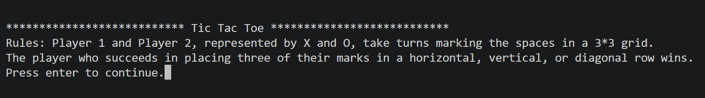
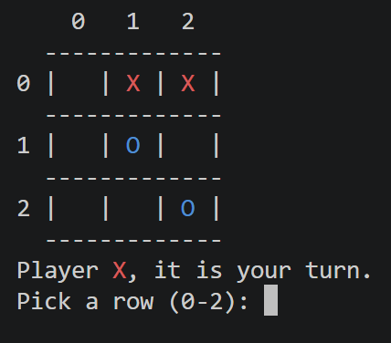
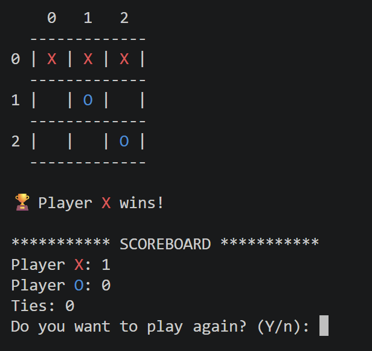

# Tic Tac Toe

A two-player Tic Tac Toe game written in Python that runs in the terminal.

## Features

- 2-player local gameplay (X vs O)
- Input validation (prevents invalid moves)
- Automatic win detection (rows, columns, diagonals)
- Score tracking across multiple rounds
- Option to play again without restarting
- Clean console UI with grid display
- Colored symbols for better visual clarity (X = red, O = blue)

## Requirements

- Python 3.x

## How to Run

```bash
py tic_tac_toe.py
```

## 🕹️ How to Play

1. Run the program
2. Player 1 chooses X or O
3. Players take turns entering:
   - Row (0–2)
   - Column (0–2)
4. First player to align 3 marks wins
5. Game tracks score and allows replay

## Preview

### Start Screen



### Gameplay



### Winner



## Skills Demonstrated

- Python functions
- Loops and conditionals
- Exception handling
- Input validation
- Game logic
- Terminal user interface

## Author

Dhuha Al-sallami